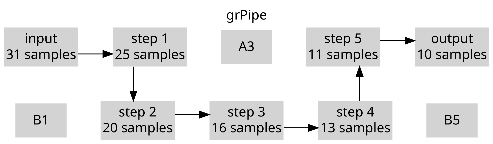
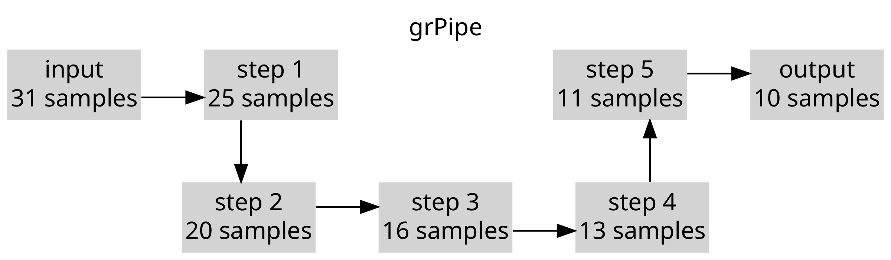
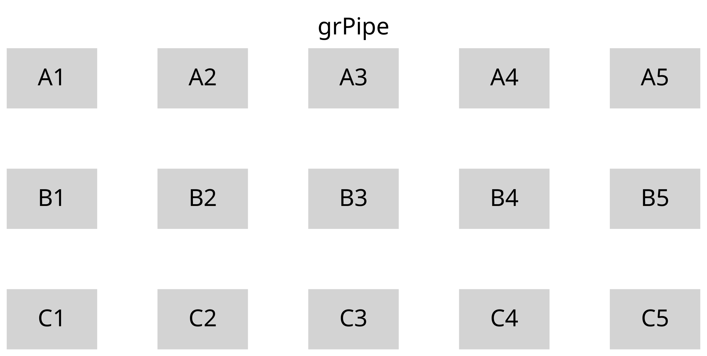
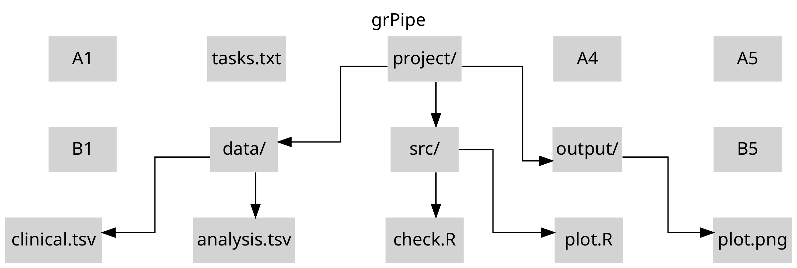
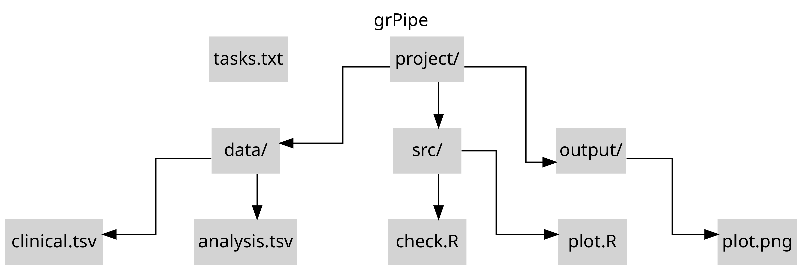

<center><font size="7">grPipe</font></center>

# Example 1

```R
library(grPipe)

# create grPipe
nodes = grPipe.create(nrow = 2, ncol = 5)
nodes
```

<table class="dataframe">
<caption>A data.frame: 1 x 3</caption>
<thead>
	<tr><th scope=col>id</th><th scope=col>id_next</th><th scope=col>text</th></tr>
	<tr><th scope=col>&lt;chr&gt;</th><th scope=col>&lt;lgl&gt;</th><th scope=col>&lt;lgl&gt;</th></tr>
</thead>
<tbody>
	<tr><td>B5</td><td>NA</td><td>NA</td></tr>
</tbody>
</table>

```R
# plot raw grPipe
grPipe.plot(
    nodes = nodes,
    pngfile = "grPipe.1a.png",
    title = "grPipe",
    showGrid = TRUE
)
```
    


```R
# add nodes
nodes = grPipe.node(nodes, "A1",  "A2",  "input\n31 samples")
nodes = grPipe.node(nodes, "A2",  "B2",  "step 1\n25 samples")
nodes = grPipe.node(nodes, "B2",  "B3",  "step 2\n20 samples")
nodes = grPipe.node(nodes, "B3",  "B4",  "step 3\n16 samples")
nodes = grPipe.node(nodes, "B4",  "A4",  "step 4\n13 samples")
nodes = grPipe.node(nodes, "A4",  "A5",  "step 5\n11 samples")

# last node (id_next = NA)
nodes = grPipe.node(nodes, "A5",  NA,  "output\n10 samples")
```

```R
# plot grPipe (showGrid = TRUE)
grPipe.plot(
    nodes = nodes,
    pngfile = "grPipe.1b.png",
    title = "grPipe",
    showGrid = TRUE
)
```
    


```R
# plot grPipe (showGrid = FALSE)
grPipe.plot(nodes = nodes, pngfile = "grPipe.1c.png", title = "grPipe")
```
  


---

# Example 2

```R
library(grPipe)

# create grPipe
nodes = grPipe.create(nrow = 3, ncol = 5)
nodes
```

<table class="dataframe">
<caption>A data.frame: 1 × 3</caption>
<thead>
	<tr><th scope=col>id</th><th scope=col>id_next</th><th scope=col>text</th></tr>
	<tr><th scope=col>&lt;chr&gt;</th><th scope=col>&lt;lgl&gt;</th><th scope=col>&lt;lgl&gt;</th></tr>
</thead>
<tbody>
	<tr><td>C5</td><td>NA</td><td>NA</td></tr>
</tbody>
</table>

```R
# plot raw grPipe
grPipe.plot(
    nodes = nodes,
    pngfile = "grPipe.2a.png",
    title = "grPipe",
    showGrid = TRUE
)
```



```R
# add nodes
nodes = grPipe.node(nodes, "A3",  "B2",  "project/")
nodes = grPipe.node(nodes, "B2",  "C1",  "data/")
nodes = grPipe.node(nodes, "B2",  "C2",  "data/")

nodes = grPipe.node(nodes, "A3",  "B3",  "project/")
nodes = grPipe.node(nodes, "B3",  "C3",  "src/")
nodes = grPipe.node(nodes, "B3",  "C4",  "src/")

nodes = grPipe.node(nodes, "A3",  "B4",  "project/")
nodes = grPipe.node(nodes, "B4",  "C5",  "output/")

# last node (id_next = NA)
nodes = grPipe.node(nodes, "C1",  NA,  "clinical.tsv")
nodes = grPipe.node(nodes, "C2",  NA,  "analysis.tsv")
nodes = grPipe.node(nodes, "C3",  NA,  "check.R")
nodes = grPipe.node(nodes, "C4",  NA,  "plot.R")
nodes = grPipe.node(nodes, "C5",  NA,  "plot.png")

# connectionless node (id_next = NA)
nodes = grPipe.node(nodes, "A2",  NA,  "tasks.txt")
```

```R
# plot grPipe (showGrid = TRUE)
grPipe.plot(
    nodes = nodes,
    pngfile = "grPipe.2b.png",
    title = "grPipe",
    showGrid = TRUE,
    colSpace = 1
)
```



```R
# plot grPipe (showGrid = TRUE)
grPipe.plot(
    nodes = nodes,
    pngfile = "grPipe.2c.png",
    title = "grPipe",
    showGrid = FALSE,
    colSpace = 1
)
```

