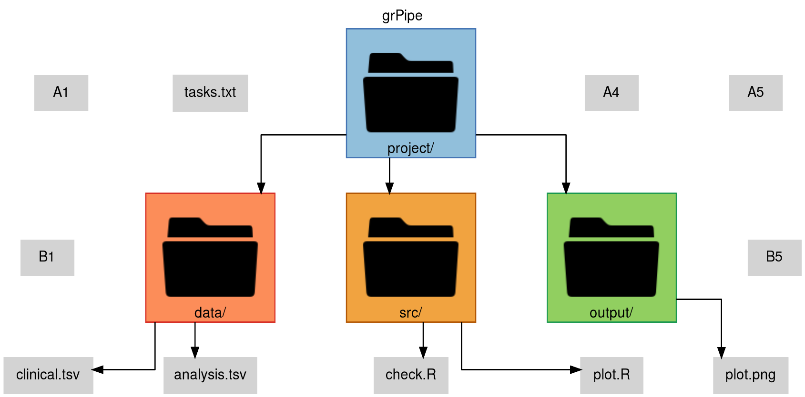

# Updates

-   0.1.0 - first version
-   0.2.0 - node attributes
-   0.3.0 - image on node

# Next Steps

-   save dot option
-   save svg option
-   add arrow text
-   arrow attributes
-   html on node
-   optimization

# Example 1

``` r
library(grPipe)

# create grPipe
nodes = grPipe.create(nrow = 3, ncol = 3)
nodes
```

| id  | id_next | text | attr | image |
|-----|---------|------|------|-------|
| C3  | NA      | NA   | NA   | NA    |

``` r
# plot raw grPipe
grPipe.plot(
    nodes = nodes,
    pngfile = "man/figures/grPipe.1a.png",
    title = "grPipe",
    showGrid = TRUE
)
```


Create png images

``` r
# iris
png("../iris1.png", width = 200, height = 200)
p = boxplot(
  main = "Iris",
  x = as.matrix(iris[,1:4]),
  col = c("#1b98e0", "#ff7f00", "#e41a1c", "#4daf4a"),
  xaxt = "n"
)
tick = seq_along(p$names)
text(tick, par("usr")[3] - 0.3, p$names, srt = 45, xpd = T, adj = 1, cex = 1)
dev.off()

# iris - setosa
png("../iris2.png", width = 200, height = 200)
p = boxplot(
  main = "Iris - Setosa",
  x = as.matrix(iris[iris$Species=="setosa",1:4]),
  col = c("#1b98e0", "#ff7f00", "#e41a1c", "#4daf4a"),
  xaxt = "n"
)
tick = seq_along(p$names)
text(tick, par("usr")[3] - 0.3, p$names, srt = 45, xpd = T, adj = 1, cex = 1)
dev.off()

# iris - versicolor
png("../iris3.png", width = 200, height = 200)
p = boxplot(
  main = "Iris - Versicolor",
  x = as.matrix(iris[iris$Species=="versicolor",1:4]),
  col = c("#1b98e0", "#ff7f00", "#e41a1c", "#4daf4a"),
  xaxt = "n"
)
tick = seq_along(p$names)
text(tick, par("usr")[3] - 0.3, p$names, srt = 45, xpd = T, adj = 1, cex = 1)
dev.off()

# iris - virginica
png("../iris4.png", width = 200, height = 200)
p = boxplot(
  main = "Iris - Virginica",
  x = as.matrix(iris[iris$Species=="virginica",1:4]),
  col = c("#1b98e0", "#ff7f00", "#e41a1c", "#4daf4a"),
  xaxt = "n"
)
tick = seq_along(p$names)
text(tick, par("usr")[3] - 0.3, p$names, srt = 45, xpd = T, adj = 1, cex = 1)
dev.off()
```

``` r
# add nodes
nodes = grPipe.node(nodes, "A1",  "A2",  paste0("Iris\n", nrow(iris), " samples"))
nodes = grPipe.node(nodes, "A2",  "B2",  "", image = "../iris1.png")
nodes = grPipe.node(nodes, "B2",  "C1", "")
nodes = grPipe.node(nodes, "B2",  "C2", "")
nodes = grPipe.node(nodes, "B2",  "C3", paste0("<
<TABLE BORDER='1' CELLSPACING='0' CELLBORDER='1'>
  <TR>
    <TD ALIGN='center' WIDTH='100' BGCOLOR='#d3d3d3'><B>Specie</B></TD>
    <TD BGCOLOR='#d3d3d3'><B>N</B></TD>
  </TR>
  <TR>
    <TD ALIGN='left'><B>Setosa</B></TD>
    <TD>", sum(iris$Species=="setosa"), "</TD>
  </TR>
  <TR>
    <TD ALIGN='left'><B>Versicolor</B></TD>
    <TD>", sum(iris$Species=="versicolor"), "</TD>
  </TR>
  <TR>
    <TD ALIGN='left'><B>Virginica</B></TD>
    <TD>", sum(iris$Species=="virginica"), "</TD>
  </TR>
</TABLE>
>"), attr = "style=filled, shape=none, fillcolor='#ffffff', color='#000000', margin=0")

# last nodes (id_next = NA)
nodes = grPipe.node(nodes, "C1",  NA,  "", image = "../iris2.png")
nodes = grPipe.node(nodes, "C2",  NA,  "", image = "../iris3.png")
nodes = grPipe.node(nodes, "C3",  NA,  "", image = "../iris4.png")
```

``` r
# plot grPipe (showGrid = TRUE)
grPipe.plot(
    nodes = nodes,
    pngfile = "man/figures/grPipe.1b.png",
    title = "grPipe",
    showGrid = TRUE
)
```


``` r
# plot grPipe (showGrid = FALSE)
grPipe.plot(
  nodes = nodes,
  pngfile = "man/figures/grPipe.1c.png",
  title = "grPipe"
)
```


------------------------------------------------------------------------

# Example 2

``` r
library(grPipe)

# create grPipe
nodes = grPipe.create(nrow = 3, ncol = 5)

# plot raw grPipe
grPipe.plot(
    nodes = nodes,
    pngfile = "man/figures/grPipe.2a.png",
    title = "grPipe",
    showGrid = TRUE
)
```


``` r
# add nodes
nodes = grPipe.node(nodes, "A3",  "B2",  "project/")
nodes = grPipe.node(nodes, "B2",  "C1",  "data/")
nodes = grPipe.node(nodes, "B2",  "C2",  "data/", "style=filled, shape=box, fillcolor='#fc8d59', color='#d73027'", image = "man/figures/directory-icon-png-8.png")

nodes = grPipe.node(nodes, "A3",  "B3",  "project/")
nodes = grPipe.node(nodes, "B3",  "C3",  "src/")
nodes = grPipe.node(nodes, "B3",  "C4",  "src/", "style=filled, shape=box, fillcolor='#f1a340', color='#b35806'", image = "man/figures/directory-icon-png-8.png")

nodes = grPipe.node(nodes, "A3",  "B4",  "project/", "style=filled, shape=box, fillcolor='#91bfdb', color='#4575b4'", image = "man/figures/directory-icon-png-8.png")
nodes = grPipe.node(nodes, "B4",  "C5",  "output/", "style=filled, shape=box, fillcolor='#91cf60', color='#1a9850'", image = "man/figures/directory-icon-png-8.png")

# last node (id_next = NA)
nodes = grPipe.node(nodes, "C1",  NA,  "clinical.tsv")
nodes = grPipe.node(nodes, "C2",  NA,  "analysis.tsv")
nodes = grPipe.node(nodes, "C3",  NA,  "check.R")
nodes = grPipe.node(nodes, "C4",  NA,  "plot.R")
nodes = grPipe.node(nodes, "C5",  NA,  "plot.png")

# connectionless node (id_next = NA)
nodes = grPipe.node(nodes, "A2",  NA,  "tasks.txt")
```

``` r
# plot grPipe (showGrid = TRUE)
grPipe.plot(
    nodes = nodes,
    pngfile = "man/figures/grPipe.2b.png",
    title = "grPipe",
    showGrid = TRUE,
    colSpace = 1
)
```



``` r
# plot grPipe (showGrid = TRUE)
grPipe.plot(
    nodes = nodes,
    pngfile = "man/figures/grPipe.2c.png",
    title = "grPipe",
    showGrid = FALSE,
    colSpace = 1
)
```


------------------------------------------------------------------------

# Observations

-   The grViz function from the DiagrammeR package does not support the "image" tag, so to solve this, the SVG was generated by the grViz function and added the "image" tag manually (look for \$imageTag in R/grPipe.plot.R).
-   The magick package is now used for:
    -   Get information about the image (height and width);
    -   Save PNG image.
-   The XML tag "text" generated by "export_svg" and added to magick_read contains a border, so it was manually removed (look for \$removeTextBorder in R/grPipe.plot.R).

------------------------------------------------------------------------

# References

> directory icon [man/figures/directory-icon-png-8.png] <https://www.freeiconspng.com/img/12388>
