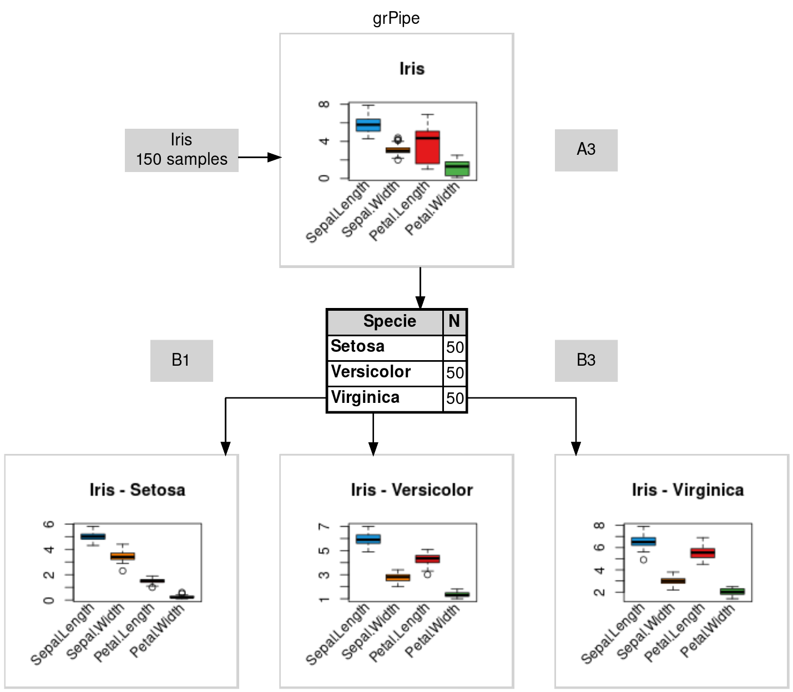

# Example 1

``` r
library(grPipe)

# create grPipe
nodes = grPipe.create(nrow = 2, ncol = 5)
nodes
```

| id      | id_next | text    |
|---------|---------|---------|
| \<chr\> | \<lgl\> | \<lgl\> |
| B5      | NA      | NA      |

A data.frame: 1 x 3

A data.frame: 1 x 3

``` r
# plot raw grPipe
grPipe.plot(
    nodes = nodes,
    pngfile = "man/figures/grPipe.1a.png",
    title = "grPipe",
    showGrid = TRUE
)
```


``` r
# add nodes
nodes = grPipe.node(nodes, "A1",  "A2",  "input\n31 samples")
nodes = grPipe.node(nodes, "A2",  "B2",  "step 1\n25 samples")
nodes = grPipe.node(nodes, "B2",  "B3",  "step 2\n20 samples")
nodes = grPipe.node(nodes, "B3",  "B4",  "step 3\n16 samples")
nodes = grPipe.node(nodes, "B4",  "A4",  "step 4\n13 samples")
nodes = grPipe.node(nodes, "A4",  "A5",  "step 5\n11 samples")

# last node (id_next = NA)
nodes = grPipe.node(nodes, "A5",  NA,  "output\n10 samples")
```

``` r
# plot grPipe (showGrid = TRUE)
grPipe.plot(
    nodes = nodes,
    pngfile = "man/figures/grPipe.1b.png",
    title = "grPipe",
    showGrid = TRUE
)
```



``` r
# plot grPipe (showGrid = FALSE)
grPipe.plot(nodes = nodes, pngfile = "man/figures/grPipe.1c.png", title = "grPipe")
```


------------------------------------------------------------------------

# Example 2

``` r
library(grPipe)

# create grPipe
nodes = grPipe.create(nrow = 3, ncol = 5)
nodes
```

| id      | id_next | text    |
|---------|---------|---------|
| \<chr\> | \<lgl\> | \<lgl\> |
| C5      | NA      | NA      |

A data.frame: 1 × 3

A data.frame: 1 × 3

``` r
# plot raw grPipe
grPipe.plot(
    nodes = nodes,
    pngfile = "man/figures/grPipe.2a.png",
    title = "grPipe",
    showGrid = TRUE
)
```


``` r
# add nodes
nodes = grPipe.node(nodes, "A3",  "B2",  "project/")
nodes = grPipe.node(nodes, "B2",  "C1",  "data/")
nodes = grPipe.node(nodes, "B2",  "C2",  "data/", "style=filled, shape=box, fillcolor='#fc8d59', color='#d73027', margin='0.3,0.3', fontcolor=white")

nodes = grPipe.node(nodes, "A3",  "B3",  "project/")
nodes = grPipe.node(nodes, "B3",  "C3",  "src/")
nodes = grPipe.node(nodes, "B3",  "C4",  "src/", "style=filled, shape=box, fillcolor='#f1a340', color='#b35806', margin='0.3,0.3', fontcolor=white")

nodes = grPipe.node(nodes, "A3",  "B4",  "project/", "style=filled, shape=box, fillcolor='#91bfdb', color='#4575b4', margin='0.3,0.3', fontcolor=white")
nodes = grPipe.node(nodes, "B4",  "C5",  "output/", "style=filled, shape=box, fillcolor='#91cf60', color='#1a9850', margin='0.3,0.3', fontcolor=white")

# last node (id_next = NA)
nodes = grPipe.node(nodes, "C1",  NA,  "clinical.tsv")
nodes = grPipe.node(nodes, "C2",  NA,  "analysis.tsv")
nodes = grPipe.node(nodes, "C3",  NA,  "check.R")
nodes = grPipe.node(nodes, "C4",  NA,  "plot.R")
nodes = grPipe.node(nodes, "C5",  NA,  "plot.png")

# connectionless node (id_next = NA)
nodes = grPipe.node(nodes, "A2",  NA,  "tasks.txt")
```

``` r
# plot grPipe (showGrid = TRUE)
grPipe.plot(
    nodes = nodes,
    pngfile = "man/figures/grPipe.2b.png",
    title = "grPipe",
    showGrid = TRUE,
    colSpace = 1
)
```


``` r
# plot grPipe (showGrid = TRUE)
grPipe.plot(
    nodes = nodes,
    pngfile = "man/figures/grPipe.2c.png",
    title = "grPipe",
    showGrid = FALSE,
    colSpace = 1
)
```


